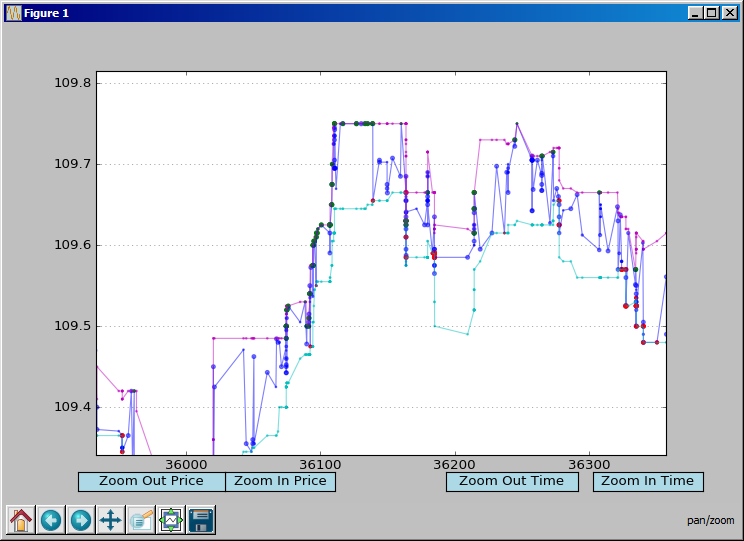

# TickPlot
Reads stock print and quote data in SpryWare csv format, colorizes the prints, and displays in an interactive plot.

Plots with matplotlib. The framework is flexible enough to add custom analyses in the events loop and plot customized data points or lines. Zoom buttons, zooming with the scrollwheel, and the pan button at the bottom provide interactive viewing of the plotted data.

Simply set the strings TRADES_FILE_PATH and QUOTES_FILE_PATH to the SpryWare csv file paths. Then toggle PLOT_UNIFORM_TIME_INTERVALS, CONNECT_PRINTS_WITH_LINE, CONNECT_QUOTES_WITH_LINE booleans as desired. 

Plot in normal time with PLOT_UNIFORM_TIME_INTERVALS set to False:

Plot in uniform time with PLOT_UNIFORM_TIME_INTERVALS set to True:

Plot with lines connecting the data points, both CONNECT_PRINTS_WITH_LINE and CONNECT_QUOTES_WITH_LINE set to True:

Tested in Python 3.5.2
